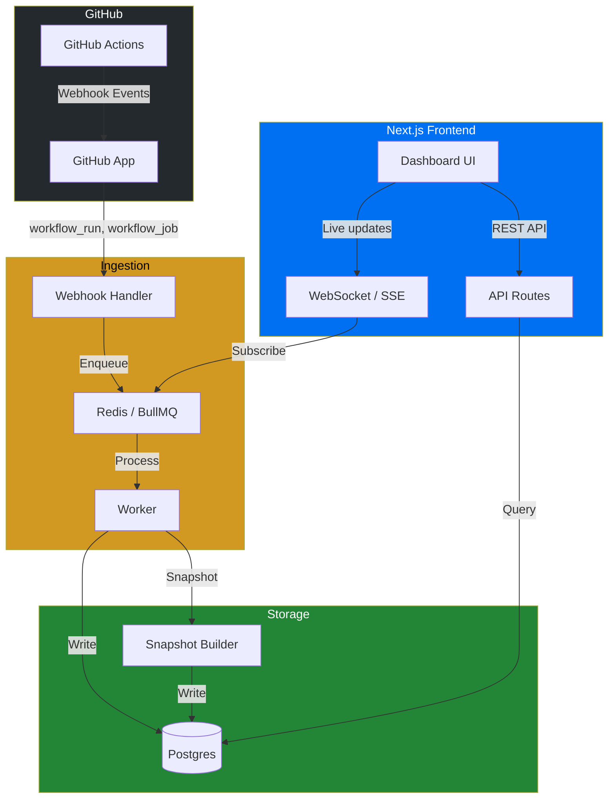

# ⏪ ActionStream

**GitHub Actions DVR Dashboard — time-travel through your CI/CD.**

ActionStream captures every GitHub Actions workflow run, job, and step event in real-time via webhooks, stores them in a time-series-friendly Postgres database, and lets you scrub through your CI/CD history like a DVR — pause, rewind, fast-forward.

## ✨ Features

- **Live Mode** — Watch workflow runs execute in real-time via WebSocket/SSE
- **Time Travel** — Scrub to any point in time and see the state of all workflows
- **Pre-computed Snapshots** — Fast loading for any time range
- **Multi-org Support** — One dashboard for all your GitHub organizations
- **Webhook Queue** — BullMQ-powered ingestion handles burst traffic gracefully

## 🏗 Architecture



## 📁 Project Structure

```
actionstream/
├── app/                    # Next.js frontend + API routes
│   ├── src/
│   │   ├── app/           # App Router pages & API routes
│   │   │   ├── api/       # Webhook + REST endpoints
│   │   │   ├── dashboard/ # Dashboard pages
│   │   │   └── layout.tsx
│   │   ├── components/    # React components
│   │   ├── hooks/         # Custom React hooks
│   │   ├── lib/           # Frontend utilities
│   │   └── styles/        # CSS
│   ├── next.config.ts
│   ├── tailwind.config.ts
│   └── tsconfig.json
├── lib/                    # Shared library code
│   ├── db/                # Prisma schema & client
│   ├── queue/             # BullMQ workers & queues
│   ├── types/             # Shared TypeScript types
│   ├── github/            # GitHub App auth & webhook verification
│   └── utils/             # Shared utilities
├── docs/                   # Architecture documentation
├── docker-compose.yml      # Local dev (Postgres + Redis)
├── github-app.yml          # GitHub App manifest
└── .env.example
```

## 🚀 Quick Start

### Prerequisites

- Node.js 20+
- Docker & Docker Compose (for Postgres + Redis)
- A GitHub App (see [GitHub App Setup](#github-app-setup))

### 1. Clone & Install

```bash
git clone git@github.com:austenstone/actionstream.git
cd actionstream
npm install
```

### 2. Start Infrastructure

```bash
docker compose up -d
```

This starts:
- **Postgres** on port 5432
- **Redis** on port 6379

### 3. Configure Environment

```bash
cp .env.example .env
# Edit .env with your GitHub App credentials
```

### 4. Set Up Database

```bash
npx prisma generate
npx prisma db push
```

### 5. Run Dev Server

```bash
npm run dev
```

Open [http://localhost:3000](http://localhost:3000) — you're live.

## 🔧 GitHub App Setup

ActionStream uses a GitHub App for webhook subscriptions and API access.

### Required Permissions

| Permission | Access | Why |
|------------|--------|-----|
| Actions | Read | Query workflow runs and jobs |
| Metadata | Read | Basic repo info |

### Required Webhook Events

| Event | Why |
|-------|-----|
| `workflow_run` | Track run lifecycle (queued → in_progress → completed) |
| `workflow_job` | Track individual job execution |

See [`github-app.yml`](./github-app.yml) for the full manifest.

### Webhook URL

Point your GitHub App's webhook URL to:
```
https://your-domain.com/api/webhooks/github
```

## 🛠 Development

```bash
# Run dev server
npm run dev

# Run queue worker (separate terminal)
npm run worker

# Generate Prisma client after schema changes
npx prisma generate

# Push schema changes to database
npx prisma db push

# Open Prisma Studio (database GUI)
npx prisma studio
```

## 📝 License

MIT
